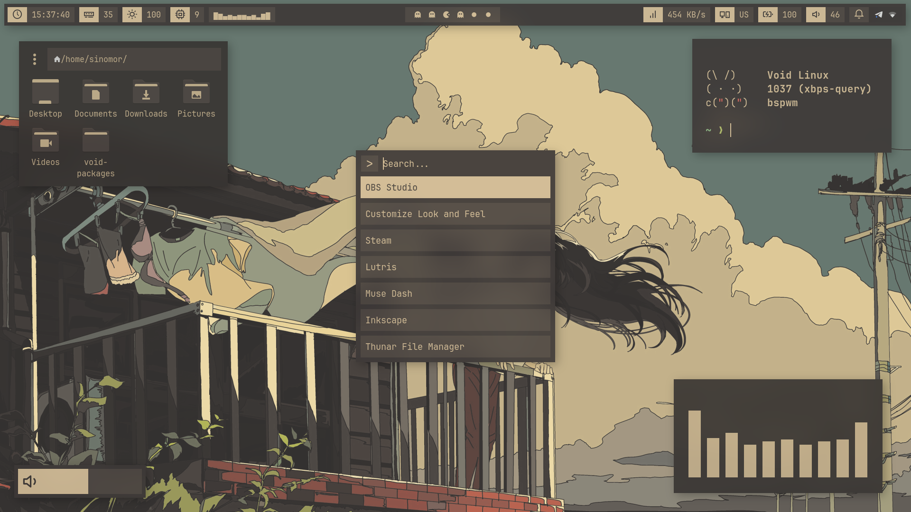

- Window Manager  [Bspwm](https://github.com/baskerville/bspwm)
- Panel  [Polybar](https://github.com/polybar/polybar)
- Launcher  [Rofi](https://github.com/davatorium/rofi)
- Notify Daemon  [Dunst](https://github.com/dunst-project/dunst)
- File Manager  [Thunar](https://gitlab.xfce.org/xfce/thunar)
- Terminal  [Alacritty](https://github.com/alacritty/alacritty)
- Font [JetBrainsMono Nerd Font](https://www.nerdfonts.com/) (included in repo)
- Visualizer  [Cava](https://github.com/karlstav/cava)
- Widgets  [Eww](https://github.com/elkowar/eww) (included in repo)


<details>
<summary><b>Install dependencies</b></summary>
<br>

> Some dependencies (not all)

```sh
bspwm alacritty xrdb sxhkd cava polybar rofi picom dunst feh polkit-gnome fontconfig \
fontconfig-32bit libX11-devel libXinerama-devel libXft-devel gdk-pixbuf gpick xclip \
ImageMagick gvfs gvfs-mtp Thunar tumbler
```

</details>

## Screenshots



## Special Thanks

- [Myagko](https://github.com/Myagko) *For gtk theme*

- [Owl](https://notabug.org/owl410) *For sharing my repo*

- [juminai](https://github.com/juminai) *For the OSD widget idea*

